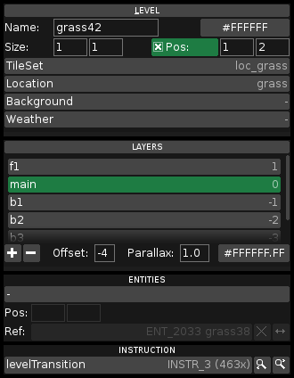

<h1 align="center">GuiLove</h1>

<p align="center">
	A not-so-simple GUI library for <a href="https://love2d.org/">LÖVE</a>.
</p>

<p align="center">
	
	<!-- <a href="https://github.com/ReFreezed/GuiLove/releases/latest">
		
	</a> -->
	<a href="https://love2d.org/">
		
	</a>
	<a href="https://github.com/ReFreezed/GuiLove/blob/master/LICENSE.txt">
		
	</a>
</p>

<p align="center">
	
</p>


## README

**GuiLove** is a GUI library for the [LÖVE](https://love2d.org/) game framework.

[The library](Gui.lua) is a single file with no external dependencies other than LÖVE.
[MIT license](LICENSE.txt).

**Note: The library is in beta, so many things (including documentation) are missing!**

- [Features](#features)
- [Basic Usage](#basic-usage)
- [API](#api)
	- [Gui Methods](#gui-methods)
	- [Element Types, Methods and Events](#element-types-methods-and-events)
	- [Includes](#includes)
	- [Tools](#tools)
- [Development and Repository](#development-and-repository)


## Features

- Retained-mode.
- Fully automatic layout calculations.
- Allows custom themes for rendering.


## Basic Usage

```lua
function love.load()
	local Gui = require("Gui")
	gui       = Gui()

	local tree = {"root",
		{"vbar", id="myContainer", width=200,
			{"text", text="I'm just a text."},
			{"input", value="foo bar"},
			{"button", id="myButton", text="Press Me!"},
		},
	}
	gui:load(tree)

	local myButton   = gui:find("myButton")
	local pressCount = 0

	myButton:on("press", function(myButton, event)
		pressCount = pressCount + 1

		local myContainer = gui:find("myContainer")
		myContainer:insert{ "text", text="Pressed button "..pressCount.." time(s)!" }
	end)

	gui:getRoot():setDimensions(love.graphics.getDimensions())
end

function love.keypressed(key, scancode, isRepeat)
	gui:keypressed(key, scancode, isRepeat)
end
function love.keyreleased(key, scancode)
	gui:keyreleased(key, scancode)
end
function love.textinput(text)
	gui:textinput(text)
end

function love.mousepressed(mx, my, mbutton, pressCount)
	gui:mousepressed(mx, my, mbutton, pressCount)
end
function love.mousemoved(mx, my)
	gui:mousemoved(mx, my)
end
function love.mousereleased(mx, my, mbutton)
	gui:mousereleased(mx, my, mbutton)
end

function love.update(dt)
	gui:update(dt)
end

function love.draw()
	gui:draw()
end
```


## API

Check the source code for more info.


### Gui Methods

```
update
draw

keypressed, keyreleased, textinput
mousepressed, mousemoved, mousereleased, wheelmoved

areStandardKeysActive, setStandardKeysActive
blur
defineStyle
find, findAll, findActive, findToggled, match, matchAll
getDefaultSound, setDefaultSound
getElementAt
getFont, setFont, getBoldFont, setBoldFont, getSmallFont, setSmallFont, getLargeFont, setLargeFont, getTooltipFont, setTooltipFont
getHoveredElement
getNavigationTarget, navigateTo, navigateToNext, navigateToPrevious, navigateToFirst, navigate, canNavigateTo
getRoot
getScissorCoordsConverter, setScissorCoordsConverter
getScrollSpeed, setScrollSpeed
getSoundPlayer, setSoundPlayer
getSpriteLoader, setSpriteLoader
getTarget, parseTargetAndEvent, getTargetCallback, setTargetCallback
getTextPreprocessor, setTextPreprocessor, reprocessTexts
getTheme, setTheme
getTime, getTimeSinceNavigation
isBusy, isKeyboardBusy, isMouseBusy
isIgnoringKeyboardInput
isInputCaptured
isInteractionLocked
isMouseGrabbed, setMouseIsGrabbed
load
ok, back
updateLayout
```


### Element Types, Methods and Events

```
(element)
- animate
- close, canClose
- exists
- getAnchor, setAnchor, getAnchorX, setAnchorX, getAnchorY, setAnchorY
- getCallback, setCallback, on, off, trigger, triggerBubbling
- getClosest
- getClosestInDirection, getNext, getPrevious
- getData, setData, swapData
- getDimensions, setDimensions, getWidth, setWidth, getHeight, setHeight
- getGui
- getGuiTime
- getId, hasId
- getIndex, getDepth
- getLayout
- getLayoutDimensions, getLayoutWidth, getLayoutHeight
- getLayoutPosition, getLayoutX, getLayoutY, getLayoutCenterPosition
- getMinDimensions, getMinWidth, getMinHeight
- getMouseCursor, getResultingMouseCursor, setMouseCursor
- getMousePosition, getMouseX, getMouseY
- getOrigin, setOrigin, getOriginX, setOriginX, getOriginY, setOriginY
- getParent, getParents, hasParent, getParentWithId, hasParentWithId, parents, parentsr, lineageUp
- getPathDescription
- getPosition, setPosition, getX, setX, getY, setY
- getPositionOnScreen, getXOnScreen, getYOnScreen
- getRoot, getNavigationRoot
- getSibling
- getSound, getResultingSound, setSound
- getStyle
- getTimeSinceBecomingVisible
- getTooltip, setTooltip, drawTooltip
- getTooltipFont, useTooltipFont
- hasTag, addTag, removeTag, removeAllTags, setTag
- isAt
- isDisplayed, getClosestHiddenElement, getFarthestHiddenElement
- isFirst, isLast
- isHidden, isVisible, setHidden, setVisible, show, hide, toggleHidden
- isHovered
- isMouseFocus, isKeyboardFocus
- isNavigationTarget
- isScrollbarXHovered, isScrollbarYHovered, isScrollbarXHandleHovered, isScrollbarYHandleHovered
- isScrollingX, isScrollingY
- isSolid
- isType
- playSound
- refresh
- remove
- reprocessTexts
- scrollIntoView
- setScissor, unsetScissor
- showMenu
- updateLayout
- Event: beforedraw, afterdraw
- Event: close, closed
- Event: focused, blurred
- Event: init
- Event: keypressed
- Event: layout
- Event: mousepressed, mousemoved, mousereleased
- Event: navigated
- Event: pressed
- Event: refresh
- Event: show, hide
- Event: textinput
- Event: update
- Event: wheelmoved

container
- find, findAll, findType, findActive, findToggled, match, matchAll
- get, children
- getChildAreaDimensions, getChildAreaWidth, getChildAreaHeight
- getChildWithData
- getElementAt
- getInnerSpace, getInnerSpaceX, getInnerSpaceY
- getMaxWidth, setMaxWidth, getMaxHeight, setMaxHeight
- getPadding, setPadding
- getScroll, getScrollX, getScrollY, setScroll, setScrollX, setScrollY, scroll, updateScroll
- getScrollHandleX, getScrollHandleY
- getScrollLimit, getScrollLimitX, getScrollLimitY
- getToggledChild, setToggledChild
- getVisibleChild, getVisibleChildNumber, getVisibleChildCount, setVisibleChild
- getVisualScroll, getVisualScrollX, getVisualScrollY
- hasScrollbars, hasScrollbarOnRight, hasScrollbarOnBottom
- indexOf
- insert, removeAt, empty
- setChildrenActive
- setChildrenHidden
- sort
- traverse, traverseType, traverseVisible

	(bar)

		hbar

		vbar

	root
	- setDimensions

(leaf)
- getAlign, setAlign
- getFont, useFont
- getMnemonicPosition
- getText, getUnprocessedText, setText, drawText, drawAlignedText
- getTextColor, setTextColor, hasTextColor, useTextColor
- isBold, setBold
- isLarge, setLarge
- isSmall, setSmall

	canvas
	- getCanvasBackgroundColor, setCanvasBackgroundColor
	- Event: draw

	image
	- Includes: imageMixin

	text

	(widget)
	- getPriority, setPriority
	- isActive, setActive
	- Event: navigate
	- Event: navupdate

		button
		- Includes: imageMixin
		- getArrow
		- getText2, getUnprocessedText2, setText2, drawText2, drawAlignedText2
		- isPressable, setPressable
		- isToggled, setToggled
		- press, isPressed
		- Event: press
		- Event: toggle

		input
		- focus, blur, isFocused
		- getField
		- getValue, setValue, getVisibleValue, drawValue
		- isPasswordActive, setPasswordActive
		- Event: change
		- Event: submit
```


### Includes

```
imageMixin
- drawImage
- getImageBackgroundColor, setImageBackgroundColor, hasImageBackgroundColor, useImageBackgroundColor
- getImageColor, setImageColor, hasImageColor, useImageColor
- getImageDimensions, setImageSize, maximizeImageSize
- getImageScale, getImageScaleX, getImageScaleY, setImageScale, setImageScaleX, setImageScaleY
- getSprite, setSprite, hasSprite
```


### Tools

```
- create9PartQuads
- draw9PartScaled
- newMonochromeImage, newImageUsingPalette
```


## Development and Repository

The library is build using a build system and a preprocessing step.
To build GuiLove, [install Lua](https://www.lua.org/download.html) and run `build/Build.cmd` or this command from the root of the repository:

```batch
lua build/build.lua
```


### Repository

| File/directory   | Description
| ---------------- | -----------
| build/           | Build system files.
| src/             | Source files that will form `Gui.lua`.
| Gui.lua          | The built library.
| defaultTheme.lua | The built default theme file.
| init.lua         | Helper file for projects cloning the repository into the project. `require"pathToGuiFolder"` can be used instead of `require"pathToGuiFolder.Gui"`.


